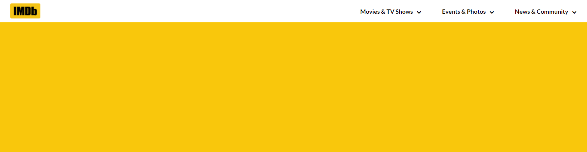

# imdBReactApp
an imdB application based on Reactjs

### Live on Netlify:

https://imdb-react-app.netlify.app/

### Day 1 (08 Dec 2020 - Tuesday):

- Today received assignment to create an imdB app based on Reactjs using Components and API calls
- I started thinking the React way (i.e., components based thinking, simply, breaking the UI into components hierarcy)
- Made a sample sketch of the app on a blank sheet in my own way
- Did some R(esearch) on APIs, Filters, Axios api call.
- By the EOD, implemented basic UI design for the app creating my first component and used CSS Grid mainly

*Here are the results:*

#### Sketch

#### Screenshot

**Note:** *Daily Progress Code Snippets are there in the ExperimentalCode directory.*

###### Any Doubts for the day:
- I was quite wondering what kind of components to create (class or function) as of now (using useState hooks) both gives quite the same results

### Day 2 (09 Dec 2020 - Wednesday):

- Started working on the individual components

#### Screenshot

### Day 3 (10 Dec 2020 - Thursday):

- Added Search functionality

#### Screenshot

### Day 4 (11 Dec 2020 - Friday):

- Added Top Movies and Mid-Section
- I was kind of stucked with the implementation of TopMovies part for quite a long time but later solved the problem using {useEffect} Hook and reffering some documentations.

#### Screenshot

### Day 5 (12 Dec 2020 - Saturday):

#### Screenshot

#### Final Updates

Thanks
